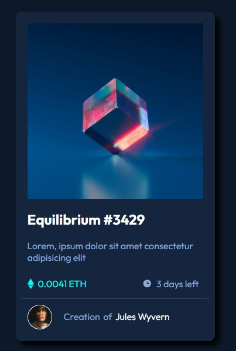

# Frontend Mentor - NFT preview card component solution

This is a solution to the [NFT preview card component challenge on Frontend Mentor](https://www.frontendmentor.io/challenges/nft-preview-card-component-SbdUL_w0U). Frontend Mentor challenges help you improve your coding skills by building realistic projects. 

## Table of contents

- [Overview](#overview)
  - [The challenge](#the-challenge)
  - [Links](#links)
- [My process](#my-process)
  - [Built with](#built-with)
  - [What I learned](#what-i-learned)
- [Author](#author)

## Overview

The purpose of this project is to improve the HTML and CSS skills.
### The challenge

Users should be able to:

- View the optimal layout depending on their device's screen size
- See hover states for interactive elements

### Links

- Solution URL: https://github.com/mauricio-tejada/NFT-card-preview
- Live Site URL: https://mauricio-tejada.github.io/NFT-card-preview

## My process

### Built with

- Semantic HTML5 markup
- SASS preprocessor
- Flexbox

### What I learned

With this simple project i was able to pratice some knowledges that i'm studying such as Semantic HTML, CSS proprities like Flexbox, preprocessor SASS and Git.

## Author

- Github profile - [Mauricio Tejada](https://github.com/mauricio-tejada)
- Frontend Mentor profile - [Mauricio Fernandes](https://www.frontendmentor.io/profile/mauricio-tejada)
- Linkedin - [Mauricio Fernandes Tejada](https://www.linkedin.com/in/mauricio-tfernandes/)

